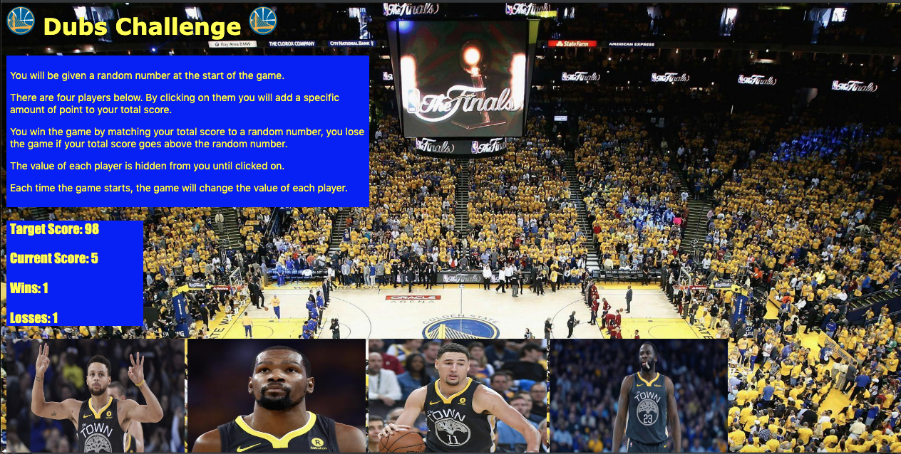

# unit-4-game (Dubs Challenge)

___

The Dubs Challenge game required the use of JavaScript in order to create the game logic whereby a random number between 19 - 120 is generated by the computer. A random number value between 1 - 12 will be assigned to four images. If the user is able to click on a combination of the four images provided representing players on the Golden State Warriors' roster to equal exactly the target number, a win is added to their win total and an alert displays on the browser congratulating them. If not, the user is alerted of having exceeded the target number, a loss is added to the loss total, a new target number is randomly selected by the computer, and the point values assigned to each player randomizes once again.

Initially I linked the JavaScript file and JQuery library to the HTML file using a script tags. Next I created the static text formatting on the HTML file using p tags within a div for the instructions. Subsequently, I assigned unique id's that would display/update text values on the DOM using JQuery for target, current score, wins, and losses. Img tags were then added containing images of each of the four players selected for this game with unique id's which would be accessed in JQuery in order to assign random point values.

In the linked JacaScript document empty variables were declared which would hold the random values generated by the computer. Next, variables containing wins, losses, and currentScore were created with their starting values at 0 so they can be incremented up as the game progressed. I declared a function to generate a random number from 19-120 which will serve as the target number the user will have to reach without exceeding in order to register a win. Then a function was declared that generates a random number from 1-12 which will be assigned to each character individually at the beginning of each turn. Following this a function was declared that starts the game by assigning values to the target score and player variables and displays target score, current score, wins, and losses. Then I declared a function that utilizes JQuery to display/update currentScore variable on DOM at #current-score div id and refreshes every time game is intialized and called this function within initializeGame(). Afterwards I declared a function that utilizes JQuery to display/update targetScore variable on the DOM at the #score div id and refreshes every time game is initialized and called the function within initializeGame(). Next I declared a function that utilizes JQuery to display/update wins/losses variables on DOM at their respective div id's and called the function within initializeGame(). Lastly, a function was declared that resets score to 0 and resets the game by calling initializeGame with a new random target score and randomly generated player values

The actual game logic was executed in a function that determines if a player has won or lost depending on the comparison of the currentScore variable to the target number variable. The player will be notified with alert depending on outcome, a win or loss will be incremented to the corresponding variable, and the resetGame function will be called re-initializing the game and setting the score to 0. Ultimately key event listener functions were declared which added a players score value to currentScore variable on each click event and determines if the target score has been reached or exceeded.

In CSS a background image was formatted to cover and expand with resizing. Then the individual images were made uniform in width/height. Text color in each div was set to yellow with a background-color of blue with 5px of padding. I created a media query to reduce the size of text below 540px and adjust image sizing.

## Built With

___

* HTML
* CSS
* JavaScript
* JQuery

___

